# Wander Social Map Onboarding Research - ScreensDesign

Date: 2026-05-30

Target app: Wander

Goal: Create a high-converting iOS onboarding structure for a social map/place-saving app without copying competitor artwork, brand, or proprietary text.

Research directory: `/Users/joelipshutz/Developer/research/screensdesign/2026-05-30-social-map-onboarding`

## Executive Summary

- Best direction: let people see the map quickly, then ask for location and notifications with plain utility framing. Do not force login before the product has shown value.
- The closest competitors often over-ask up front. Mapstr and AllTrails both create friction with early account/paywall moments; Wander can differentiate by letting guests browse and hit the save moment first.
- Permissions should be pre-prompted in product language, not legal language. Autio is the clearest reference: explain what location/notifications unlock, then call the iOS prompt.
- Roamy is the best reference for "save from link" and delayed monetization after user investment. Its core lesson is to convert scattered inspiration into map/trip structure.
- Seed Oil Scout is useful for map legends and community-contributed metadata. Wander should teach pin colors/statuses lightly, not bury users in taxonomy.
- The onboarding should capture only high-signal preferences: categories, home/current location permission, notification intent. Friend graph and account can wait.
- Paywall thesis: freemium after value. Allow roughly 20 saved places free, then gate unlimited saves, unlimited link imports, friend circles/private maps, and trip packs.
- Current Wander mocks are visually close: tan Rodeo-like palette, playful headings, terracotta CTA, emoji category markers, map-first UI. Onboarding should extend that system rather than introduce a new visual language.

## Competitor Matrix

| App | Screens captured | Main promise | Key mechanics | Notes for Wander |
|---|---:|---|---|---|
| Mapstr | 4 | Save and follow places on a personal map | Account setup, profile completion, place tags, ratings, social maps | Direct competitor. Avoid its early account friction; borrow rich place detail and "to try/done" mental model. |
| Roamy | 4 | Never lose a hidden gem again | Trip intent quiz, social/link imports, itinerary generation, delayed paywall | Strong for save-from-Instagram/TikTok and paywall after investment. |
| Autio | 4 | Location-based stories along your journey | Guest mode, location and notification pre-prompts, map-first discovery | Best permission framing reference. Use softer, more Wander-native copy. |
| AllTrails | 4 | Find and navigate trails | Progress quiz, social auth, trial paywall, feature comparison | Strong filters/paywall clarity; weak because auth/paywall happen before browsing. |
| Seed Oil Scout | 4 | Community map for healthy dining | Educational onboarding, map legend, color-coded pins, contributor reports | Useful for pin legend and niche metadata. Too heavy/problem-first for Wander's lighter travel buddy feel. |

## Current Wander Baseline

The PDF was converted to PNG before analysis:

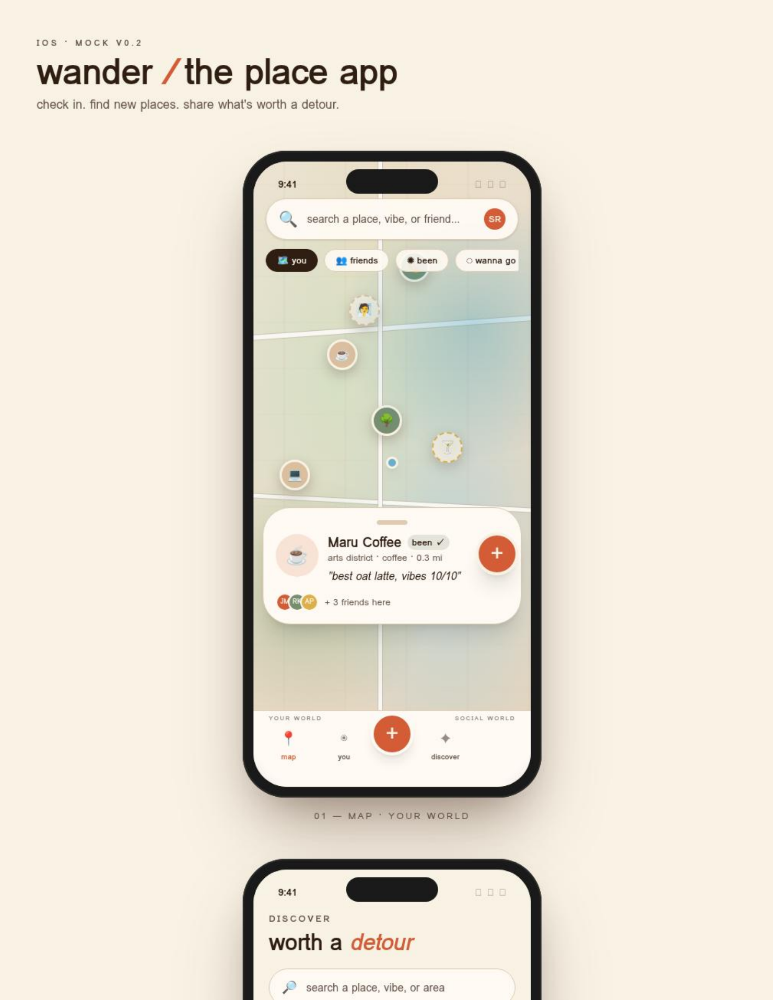
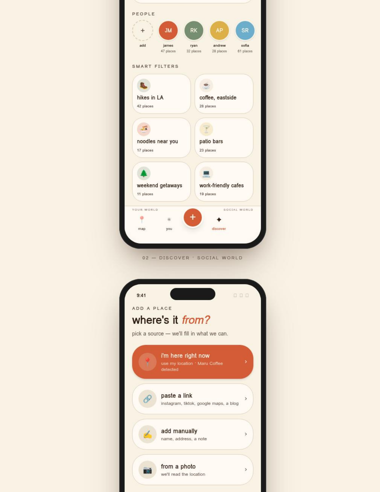
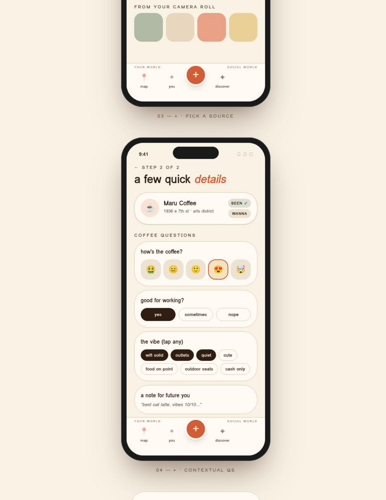
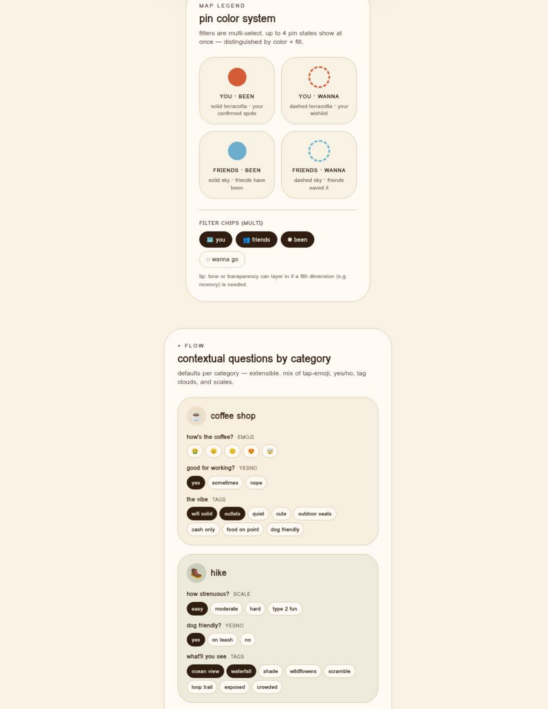
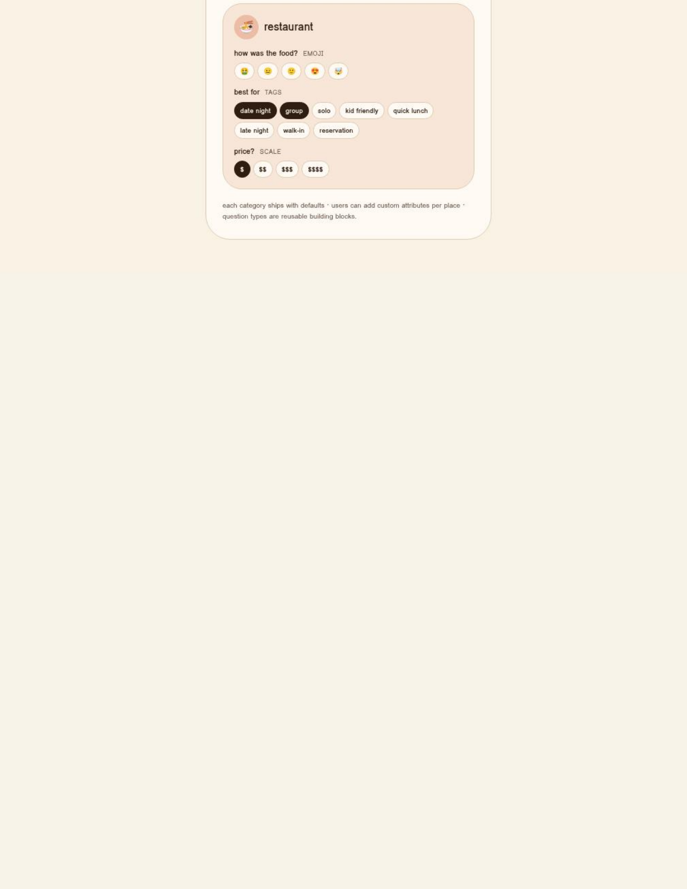

What is working:

- The app already feels map-first, with search, filter chips, pins, and a place card.
- "Your world" vs "social world" is a useful framing for personal vs friend/community content.
- The plus flow is clear: current location, link, manual, photo.
- Contextual question cards are the right product mechanic for richer place memory.
- The pin color system is good enough for a v1, but onboarding should teach only one or two concepts at first.

What onboarding needs to add:

- A first-run reason for location access.
- A first-run reason for notifications that is not spammy.
- A soft category preference step to tune Discover.
- A delayed account gate at the first save, share, or sync intent.
- A later freemium gate after the free saved-place limit.

## Flow Teardowns

### Mapstr - Save & Follow Places

Source: https://screensdesign.com/showcase/mapstr-save-share-places

Overall structure: Mapstr leads with travel/place inspiration, then pushes account creation and profile completion before the user reaches the map. The public teardown highlights rich saved-place details, tags, ratings, statuses, photos, visit logs, and social following.

- Purpose: Promise a personal/social place map.
- Copy pattern: Broad aspiration around future trips.
- UI pattern: Full-bleed lifestyle photo, large centered headline, bright primary CTA.
- Why it works: The hero makes the app feel human and travel-oriented, not just a utility.
- What not to copy: Early "Create my account" is too heavy for Wander's hunch.

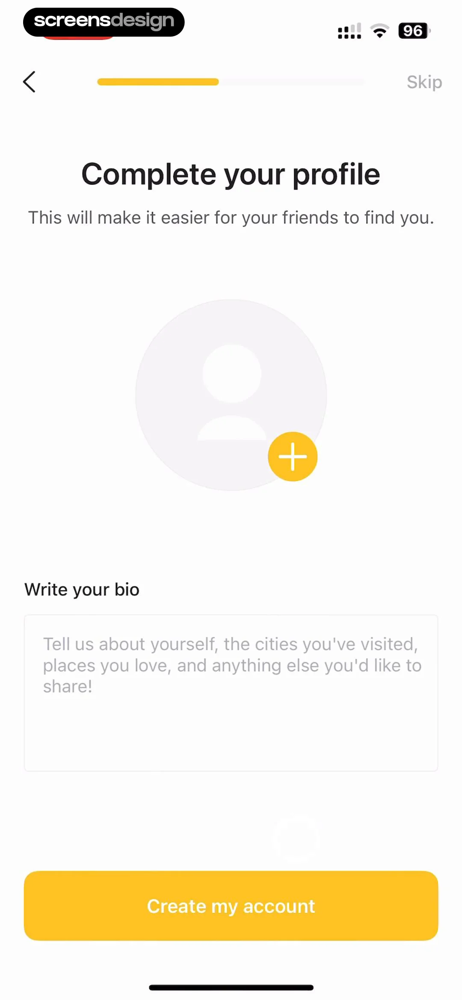

- Purpose: Complete profile before entry.
- Copy pattern: "This helps friends find you."
- UI pattern: Progress bar, avatar upload, bio field, CTA.
- Why it works: The social value is explicit.
- What not to copy: Profile setup before the user saves anything adds friction.

Wander takeaways:

- Keep the emotional outcome: "remember and share places worth coming back to."
- Delay profile and friend graph until a user tries to save, share, follow, or sync.
- Borrow the rich place model, but make first capture lightweight.

### Roamy - Save Spot & Plan Trips

Source: https://screensdesign.com/showcase/roamy-save-spot-plan-trips

Overall structure: Roamy sells a clear painkiller: social/travel inspiration gets lost. The flow then asks trip-planning questions and demonstrates importing social links and creating routes.

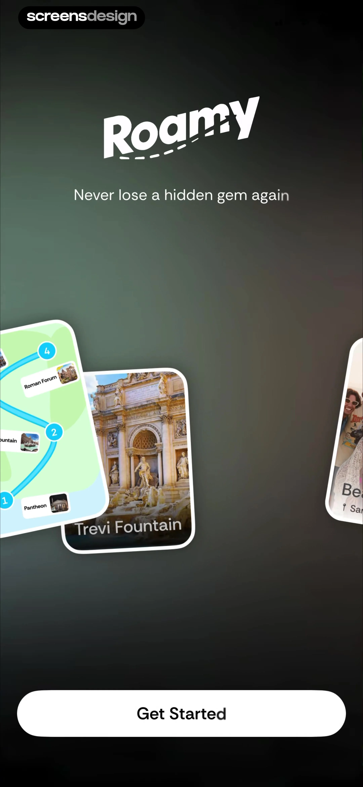

- Purpose: Hook with a crisp pain statement.
- Copy pattern: "Never lose a hidden gem again."
- UI pattern: Dark, branded welcome screen with floating travel cards and one CTA.
- Why it works: The problem is instantly legible.
- What not to copy: Wander should stay in its tan/map system, not move to dark cinematic branding.

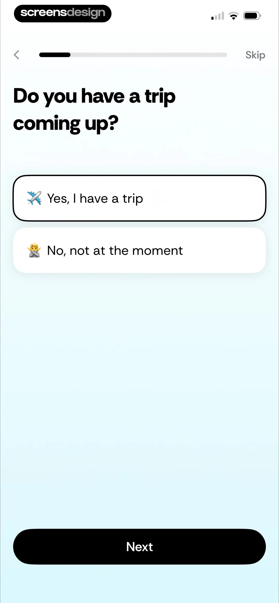

- Purpose: Personalize around upcoming travel.
- Copy pattern: Direct question with two large answer cards.
- UI pattern: Progress bar, large type, single-answer options, big sticky CTA.
- Why it works: The question is easy and immediately relevant.
- What not to copy: Wander should avoid a long quiz unless each question clearly improves the map.

Wander takeaways:

- Use one low-friction category/preferences screen, not a long trip questionnaire.
- Treat TikTok/Instagram/Google Maps link import as a core activation path.
- Push the paywall after a user has saved places or imported value.

### Autio - Road Trip & Travel App

Source: https://screensdesign.com/showcase/autio-road-trip-travel-app

Overall structure: Autio explains that the app needs permissions to surface location-based stories, then pre-prompts notifications and lets users continue as guest.

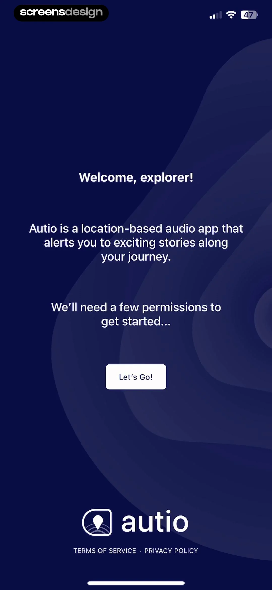

- Purpose: Explain that permissions are part of the core product.
- Copy pattern: "We'll need a few permissions to get started."
- UI pattern: Simple centered copy on a branded background.
- Why it works: It frames permission asks before the iOS prompt.
- What not to copy: It is still permission-first; Wander can warm up with a map promise first.

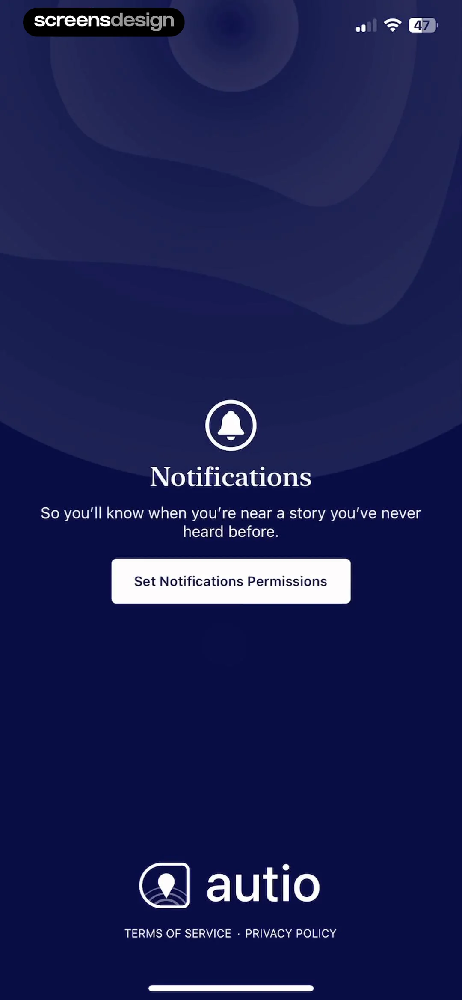

- Purpose: Notification pre-prompt.
- Copy pattern: Notifications are tied to being near relevant content.
- UI pattern: Large icon, short reason, single CTA.
- Why it works: The notification reason is specific, not generic.
- What not to copy: "Set Notifications Permissions" is too technical for Wander.

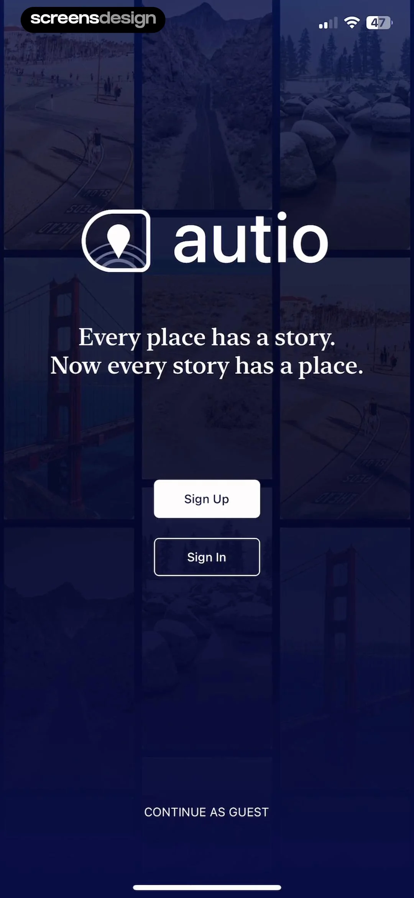

- Purpose: Offer auth while preserving guest access.
- Copy pattern: Strong place/story tagline, sign up/in, guest option.
- UI pattern: Background travel collage, primary auth buttons, text guest link.
- Why it works: Guest mode lowers entry friction.
- What not to copy: Do not make auth a top-level choice before users understand saving.

Wander takeaways:

- Use permission pre-prompts with exact utility:
  - Location: "show where you are, detect the place you're adding, and sort nearby recs."
  - Notifications: "saved-place reminders, friends' recs near you, trip prompts."
- Include "Not now" and make the app still usable.
- Preserve guest mode until save/share/sync intent.

### AllTrails - Hike, Bike & Run

Source: https://screensdesign.com/showcase/alltrails-hike-bike-run

Overall structure: AllTrails uses a short setup, then requires auth and presents a trial paywall before the full experience. Its paywall is clear and structured, but the timing is high-friction.

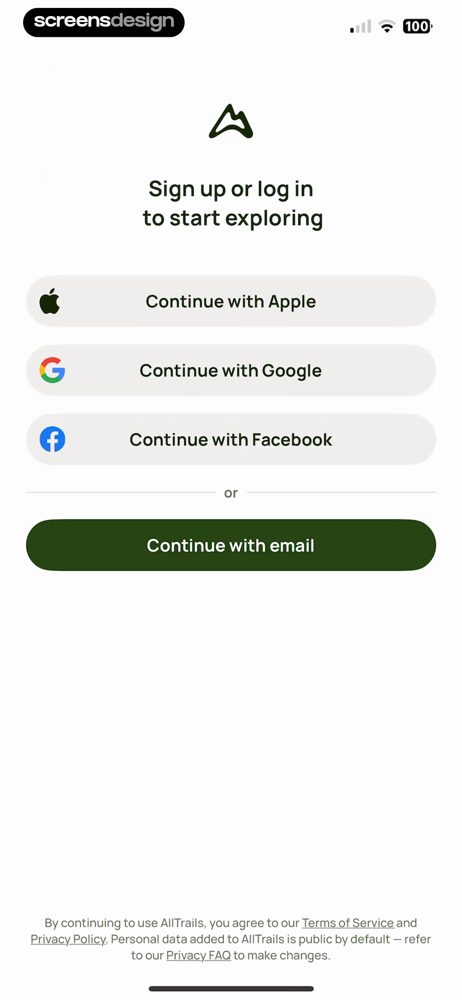

- Purpose: Ask a simple personalization question.
- Copy pattern: Direct, large question with two answer cards.
- UI pattern: Progress bar, skip option, sticky CTA.
- Why it works: The input is easy and provides discovery context.
- What not to copy: Wander does not need a trip-planning quiz before the map.

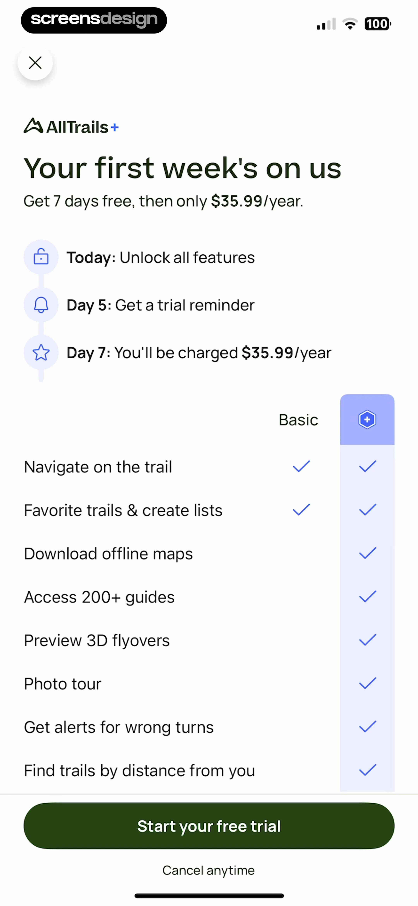

- Purpose: Force sign-up/log-in.
- Copy pattern: "Sign up or log in to start exploring."
- UI pattern: Social auth buttons and email option.
- Why it works: Simple auth presentation.
- What not to copy: This is exactly the friction Wander should avoid before save intent.

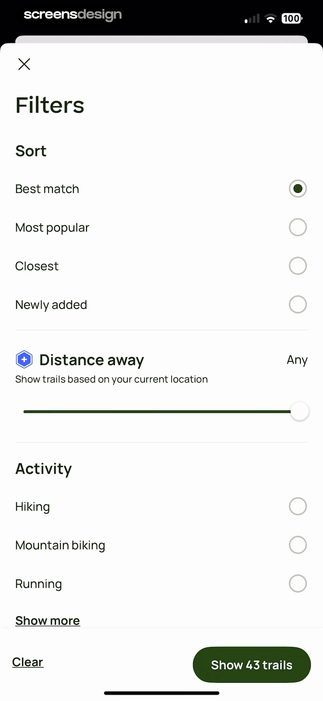

- Purpose: Trial paywall.
- Copy pattern: "Your first week's on us", timeline, feature comparison.
- UI pattern: Trial timeline plus Basic vs Plus comparison.
- Why it works: Clear trial mechanics and value stacking.
- What not to copy: Do not show this before a user has built a map.

Wander takeaways:

- Use the clarity of the feature comparison, but trigger after save #21 or an advanced feature action.
- A "20 free saves" usage-meter paywall is more aligned with the product than an immediate trial.
- If a trial is used, explain billing dates with the same clarity.

### Seed Oil Scout - Healthy Dining

Source: https://screensdesign.com/showcase/seed-oil-scout-healthy-dining

Overall structure: Seed Oil Scout uses educational onboarding to create urgency, then teaches map legends and community scouting. It is heavier and more problem-driven than Wander, but the map explanation is useful.

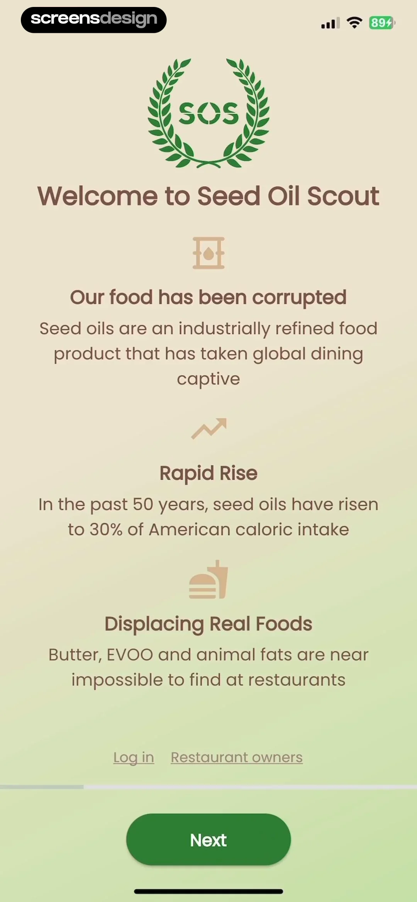

- Purpose: Establish problem and mission.
- Copy pattern: Educational, issue-first narrative.
- UI pattern: Centered logo, stacked facts, progress indicator, sticky CTA.
- Why it works: It makes the niche mission clear.
- What not to copy: Wander should not open with a lecture.

Wander takeaways:

- Borrow the idea of a short pin legend/tutorial, not the dense educational framing.
- Make user contribution feel social and lightweight: "add what you noticed" rather than "report data."
- Community metadata can power smart filters if the first capture flow stays fast.

## Cross-App Patterns

### Pattern: Explain permissions before the native prompt

- Evidence: Autio uses dedicated location/notification setup screens; location-based utility is central to its product.
- Why it works: It tells users what they gain from granting access.
- Wander adaptation: Ask for location after the welcome/map promise. Ask for notifications after explaining specific pings: saved-place reminders, friend recs near you, and trip prompts.

### Pattern: Defer auth until value or intent

- Evidence: Autio includes guest mode; Mapstr and AllTrails create friction by requiring account creation early.
- Why it works: People need to experience a map/place utility before committing identity.
- Wander adaptation: Let users browse the map and complete first-run setup as guest. Trigger auth only on save, share, follow friend, sync, or import history.

### Pattern: Use one easy personalization screen

- Evidence: Roamy and AllTrails use large answer cards with progress indicators.
- Why it works: It creates a feeling of personalization without heavy typing.
- Wander adaptation: Ask "What do you save most?" with multi-select chips. Use the result for Discover defaults and contextual plus questions.

### Pattern: Teach map states lightly

- Evidence: Seed Oil Scout highlights clear map legend value; Wander already has You/Friends x Been/Wanna pin states.
- Why it works: Maps get confusing quickly when pins encode too much.
- Wander adaptation: Show a tiny 2x2 legend in onboarding or first map coachmark, then keep details in Settings/Help.

### Pattern: Paywall when the user understands the constraint

- Evidence: Roamy delays paywall until after user investment; AllTrails has a very clear paywall but triggers too early.
- Why it works: A paywall converts better when the user knows what they are protecting or expanding.
- Wander adaptation: Freemium gate after roughly 20 saved places. Message it as "your map is filling up" and make the upgrade about unlimited saves, private friend circles, trip packs, and link imports.

## Recommended Wander Onboarding Structure

1. **Welcome / map promise**
   - Goal: Establish Wander as the place memory/social map app.
   - Draft headline: "Keep the places worth coming back to."
   - UI: Existing tan background, soft map preview, terracotta CTA.
   - Data captured: none.
   - CTA: "Start with the map"; secondary "Sign in".

2. **Location pre-prompt**
   - Goal: Request location with clear value.
   - Draft headline: "Find what is nearby."
   - Body: "Use location to show where you are, detect the place you are adding, and sort recs around you."
   - UI: Map card centered on current dot with one or two friend pins.
   - Data captured: `location_permission_prompted`, native permission result.
   - CTA: "Allow location"; secondary "Not now".

3. **Notifications pre-prompt**
   - Goal: Ask for notifications without sounding spammy.
   - Draft headline: "Only the useful pings."
   - Body: "Get reminders for saved places, friend recs near you, and trip ideas you asked for."
   - UI: Three small notification examples.
   - Data captured: `notifications_permission_prompted`, native permission result.
   - CTA: "Turn on notifications"; secondary "Maybe later".

4. **Category preferences**
   - Goal: Tune Discover and contextual plus questions.
   - Draft headline: "What do you save most?"
   - UI: Multi-select chips: coffee, restaurants, hikes, bars, parks, work cafes, wellness, nature.
   - Data captured: `preferred_categories[]`.
   - CTA: "Continue".

5. **Activation: add first place**
   - Goal: Teach the plus button and the app's capture methods.
   - Draft headline: "Add your first place."
   - UI: Four source rows matching existing mocks: here now, paste a link, add manually, from a photo.
   - Data captured: `first_add_source_selected`.
   - CTA: "Try the +"; secondary "Explore first".

6. **Auth gate at save intent**
   - Trigger: User taps Save, Share, Follow, Sync, or tries to persist a first place.
   - Draft headline: "Save Maru Coffee?"
   - Body: "Create a free account to keep your places synced and share recs with friends."
   - UI: Place card plus Apple/Google/email auth buttons.
   - Data captured: account identity only after intent.
   - CTA: "Continue with Apple"; secondary "Keep browsing".

7. **Freemium paywall after value**
   - Trigger: User attempts save #21 or heavy premium action.
   - Draft headline: "Your map is filling up."
   - Body: "20 places are free. Go unlimited when Wander becomes your real map."
   - UI: Usage meter, feature checklist, plan CTA.
   - Premium value stack: unlimited saves, unlimited link imports, private friend circles, trip packs, export/backup.
   - CTA: "Go unlimited"; secondary "Not now".

## Design Direction

- Layout: Keep existing iPhone mock style: generous top spacing, one clear task per screen, large rounded source rows, bottom sticky CTA.
- Typography: Keep the playful sans direction from the mocks. Use bigger display headings only on true onboarding screens; keep inputs/cards tighter.
- Color/mood: Tan base, dark espresso text, terracotta primary CTA, sage/sky/gold supporting pin states. Avoid turning the app into a dark travel-planning product.
- Imagery: Prefer map fragments, place cards, friend initials, and category emoji over generic lifestyle photos.
- Motion: Subtle map pin drops, CTA press states, and a short "spot saved" confirmation. Avoid long cinematic onboarding.
- Accessibility: High-contrast body text, tap targets at least 44px, permission screens with secondary options, and no critical information encoded by color alone.

## Implementation Requirements

### Data/state

- `onboardingVersion`
- `hasCompletedOnboarding`
- `locationPermissionStatus`
- `notificationPermissionStatus`
- `preferredCategories: string[]`
- `guestSessionId`
- `authGateReason: save | share | follow | sync | import`
- `savedPlaceCount`
- `freeSaveLimit` default `20`
- `paywallSeenAtSaveCount`

### Analytics events

- `onboarding_started`
- `onboarding_screen_viewed` with `screen_id`
- `permission_preprompt_viewed` with `permission_type`
- `permission_requested` with `permission_type`
- `permission_result` with `permission_type`, `status`
- `onboarding_category_selected` with `category_id`
- `onboarding_completed`
- `add_place_source_selected` with `source`
- `auth_gate_viewed` with `reason`
- `auth_completed` with `method`, `reason`
- `free_save_limit_reached` with `saved_place_count`
- `paywall_viewed` with `trigger`
- `paywall_cta_tapped`
- `paywall_dismissed`

### Experiments

- Location timing: before category preferences vs when user first opens map.
- Notification timing: onboarding vs after first save.
- Auth timing: first save vs second save.
- Free limit: 10 vs 20 vs 30 saved places.
- Paywall frame: "unlimited saves" vs "private maps with friends" vs "save from every link."

## Risks / Do Not Copy

- Do not copy Mapstr's early account wall. It is directly competitive and conflicts with the product hunch.
- Do not copy Roamy's dark brand, mascot, or exact link-import framing.
- Do not copy Autio's visual identity or permission button copy.
- Do not copy AllTrails' early forced auth/paywall timing.
- Do not make notifications sound broad or promotional. Tie them to user-controlled triggers.
- Do not over-teach the pin legend in onboarding. Let the map remain simple.
- Do not turn "lists" back into the IA. Keep saved states, smart filters, and map collections instead.

## Preview Mock

Static onboarding board:

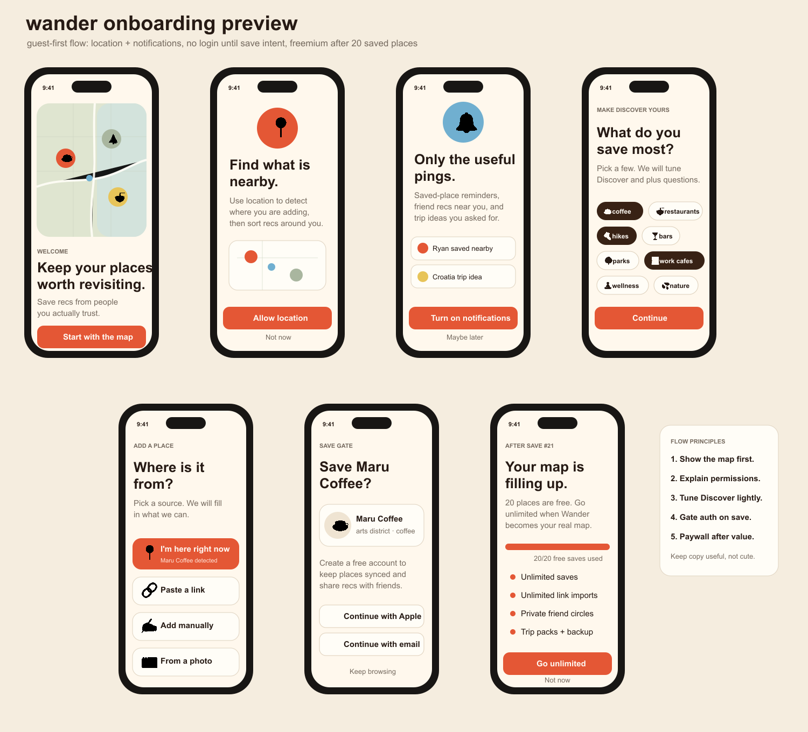

## Sources

- [Mapstr - Save & Follow Places on ScreensDesign](https://screensdesign.com/showcase/mapstr-save-share-places)
- [Roamy - Save Spot & Plan Trips on ScreensDesign](https://screensdesign.com/showcase/roamy-save-spot-plan-trips)
- [Autio - Road Trip & Travel App on ScreensDesign](https://screensdesign.com/showcase/autio-road-trip-travel-app)
- [AllTrails - Hike, Bike & Run on ScreensDesign](https://screensdesign.com/showcase/alltrails-hike-bike-run)
- [Seed Oil Scout - Healthy Dining on ScreensDesign](https://screensdesign.com/showcase/seed-oil-scout-healthy-dining)
